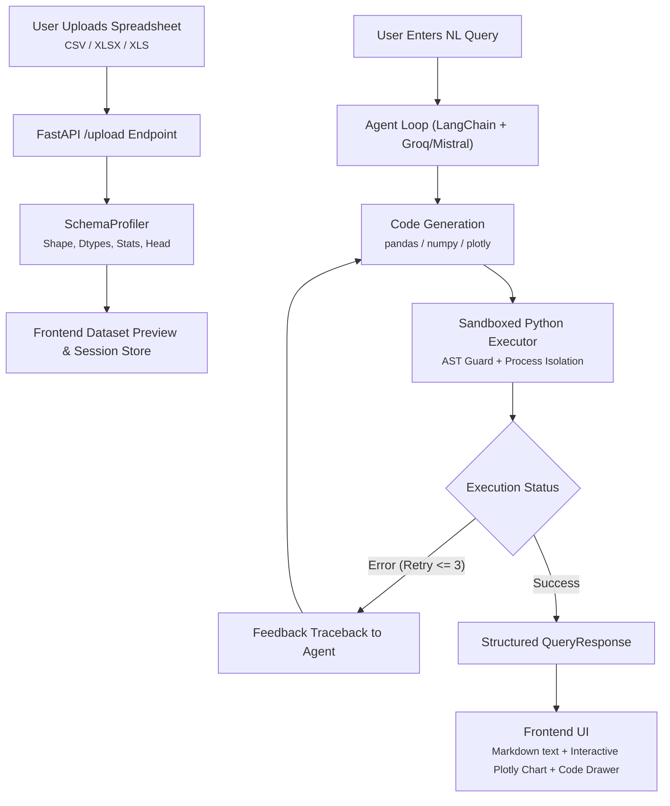

# 📊 Data Analysis Agent ("Chat With Your Spreadsheet")

An autonomous, production-grade data analysis assistant that enables users to upload CSV and Excel spreadsheets, ask questions in natural language, and receive accurate answers powered by automatically generated, sandboxed, and self-correcting Python (`pandas`, `numpy`, `plotly`) code.

---

## 🌟 Key Features

- **Dynamic Schema Profiling**: Automatically extracts column data types, missing value percentages, summary statistics (min/max/mean, top categories), and preview rows, synthesizing a token-efficient "Data Card" for the LLM without hallucinatory schemas.
- **Sandboxed Python Execution**: Code runs inside an isolated execution environment with AST and runtime guards blocking unauthorized filesystem, network, and system access (`os`, `sys`, `subprocess`, `socket`, `open` are blocked).
- **Autonomous Self-Correction Loop**: If generated code fails with a syntax or runtime error, the agent captures the traceback, updates its context, and repairs the script automatically (up to 3 retries).
- **Interactive Plotly Visualizations**: Plotly charts (`px` / `go`) are generated server-side as JSON specs and rendered client-side with interactive tooltips, dark-mode themes, and responsive auto-scaling.
- **Modern Single-Page UI**: Fast, responsive web interface built with vanilla HTML, CSS, and ES6 JavaScript. Features an Emerald Teal & Deep Navy analytics design system, drag-and-drop file upload, session inspector, dataset summary metrics, and formatted markdown messaging.
- **Dual LLM Provider Support**: Out-of-the-box compatibility with **Groq** (`llama-3.3-70b-versatile`, `openai/gpt-oss-120b`) and **Mistral AI** (`mistral-large-latest`, `mistral-small-latest`).
- **Multi-Turn Session Memory**: Keeps uploaded dataframes and conversation context active in memory for seamless follow-up questions.
- **Production-Ready Docker Setup**: Includes container definitions for the FastAPI backend and an Nginx static web server.

---

## 🏗️ Architecture & Workflow



---

## 🛠️ Technology Stack

- **Backend**: Python 3.11, [FastAPI](https://fastapi.tiangolo.com/), [Uvicorn](https://www.uvicorn.org/), [Pydantic v2](https://docs.pydantic.dev/)
- **Data & Visualizations**: [Pandas](https://pandas.pydata.org/), [NumPy](https://numpy.org/), [Plotly](https://plotly.com/python/), [OpenPyXL](https://openpyxl.readthedocs.io/)
- **AI & Orchestration**: [LangChain](https://www.langchain.com/), [Groq](https://groq.com/), [Mistral AI](https://mistral.ai/)
- **Frontend**: Vanilla HTML5, Modern CSS3 (CSS Variables, Flexbox, Grid), ES6 JavaScript, [Plotly.js](https://plotly.com/javascript/), [marked.js](https://marked.js.org/)
- **DevOps & Testing**: Docker, Docker Compose, Nginx Alpine, [Pytest](https://docs.pytest.org/), [uv](https://github.com/astral-sh/uv)

---

## 📁 Repository Structure

```text
├── backend/
│   ├── agent/                 # Agent loop, prompts, and self-correction
│   │   ├── agent_builder.py
│   │   ├── prompts.py
│   │   └── self_correct.py
│   ├── models/                # Pydantic request/response schemas
│   │   └── schemas.py
│   ├── profiler/              # Dataset metadata & summary extraction
│   │   └── schema_profiler.py
│   ├── sandbox/               # Isolated code execution & AST security checks
│   │   ├── docker_sandbox.py
│   │   └── executor.py
│   ├── session/               # In-memory thread-safe session manager
│   │   └── session_manager.py
│   ├── tests/                 # Automated unit and integration tests
│   │   ├── test_agent_loop.py
│   │   ├── test_executor.py
│   │   └── test_profiler.py
│   ├── config.py              # Settings via pydantic-settings
│   ├── Dockerfile             # Backend container image
│   ├── main.py                # FastAPI entrypoint and REST routes
│   └── requirements.txt       # Python dependencies
├── frontend/
│   ├── app.js                 # Frontend application logic & API client
│   ├── Dockerfile             # Nginx static file container image
│   ├── index.html             # Single-page interface markup
│   └── style.css              # Deep Navy / Emerald Teal design system
├── docs/                      # Technical documentation and deep dives
├── .env.example               # Template environment variables
├── .gitignore                 # Git ignore rules
├── docker-compose.yml         # Full-stack Docker composition
├── pytest.ini                 # Pytest configuration
└── README.md                  # Project overview & documentation
```

---

## 🚀 Getting Started

### 1. Prerequisites

- **Python**: 3.11 or newer
- **Package Manager**: [uv](https://github.com/astral-sh/uv) (recommended) or `pip`
- **Static Server (Optional)**: Node.js / `npx` or Python `http.server` for serving frontend files locally.

### 2. Environment Configuration

Clone or navigate into the project directory and create a `.env` file from `.env.example`:

```bash
cp .env.example .env
```

Configure your credentials in `.env`:

```env
# LLM Provider ("groq" or "mistral")
LLM_PROVIDER=groq
GROQ_API_KEY=gsk_your_groq_api_key_here
MODEL_NAME=llama-3.3-70b-versatile

# Optional Mistral configuration
# LLM_PROVIDER=mistral
# MISTRAL_API_KEY=your_mistral_key_here
# MODEL_NAME=mistral-large-latest

# Limits & Sandbox Settings
MAX_RETRIES=3
SANDBOX_TIMEOUT_SECONDS=15
MAX_UPLOAD_MB=25
SESSION_TTL_MINUTES=60
USE_DOCKER_SANDBOX=false
```

---

### 3. Local Installation & Launch

#### Install Dependencies
Using `uv`:
```bash
uv pip install -r backend/requirements.txt
```
Or standard `pip`:
```bash
pip install -r backend/requirements.txt
```

#### Run the FastAPI Backend
```bash
uv run uvicorn backend.main:app --host 0.0.0.0 --port 8000 --reload
```
- API Endpoint: `http://localhost:8000`
- Interactive OpenAPI Docs: [http://localhost:8000/docs](http://localhost:8000/docs)
- Health Check: [http://localhost:8000/health](http://localhost:8000/health)

#### Run the Frontend UI
You can serve the static frontend on port 3000 using any HTTP server:

Using `npx serve`:
```bash
npx -y serve frontend -l 3000 --no-clipboard
```
Or using Python:
```bash
python -m http.server 3000 --directory frontend
```

Open [http://localhost:3000](http://localhost:3000) in your browser.

---

## 🐳 Docker Deployment

To build and run both the FastAPI backend and Nginx-powered frontend in containers:

```bash
docker compose up --build -d
```

- **Frontend Application**: [http://localhost:3000](http://localhost:3000)
- **FastAPI Backend**: [http://localhost:8000](http://localhost:8000)
- **API Documentation**: [http://localhost:8000/docs](http://localhost:8000/docs)

To stop the services:
```bash
docker compose down
```

---

## 🔌 API Endpoints

| Method | Route | Description |
| :--- | :--- | :--- |
| `POST` | `/upload` | Accepts multipart `.csv`, `.xlsx`, `.xls` file; initializes session and returns schema profile |
| `POST` | `/query` | Executes natural language query against active session dataframe |
| `GET` | `/session/{session_id}` | Retrieves session dataset schema metadata and history |
| `DELETE` | `/session/{session_id}` | Cleans up session and frees dataframe from memory |
| `GET` | `/health` | Health check returning status, active LLM provider, and model name |

---

## 🛡️ Sandbox & Security Protections

Code generated by the LLM is executed with strict multi-layer guardrails:

| Protection Layer | Subprocess Sandbox (Default) | Docker Sandbox (`USE_DOCKER_SANDBOX=true`) |
| :--- | :--- | :--- |
| **AST Static Analysis** | Rejects AST nodes attempting `import os, sys, subprocess, socket`, `eval()`, `exec()`, `open()` | Same AST inspection rules apply |
| **Namespace Isolation** | Clean execution namespace containing only `df`, `pd`, `np`, `px`, `go` | Fully isolated container runtime |
| **Filesystem Access** | In-memory only; no filesystem write access allowed | Read-only container root (`--read-only`) |
| **Network Access** | Local loopback restricted | Network interface completely disabled (`--network=none`) |
| **Timeouts** | Hard wall-clock timeout (default: 15s) | Hard container execution timeout |

---

## 🧪 Automated Testing

The backend includes a comprehensive test suite covering schema profiling, sandbox execution, AST blocking, and self-correction loops.

Run all tests via `pytest`:

```bash
uv run pytest backend/tests -v
```

Test modules:
- `backend/tests/test_profiler.py`: Verifies numeric summaries, categorical frequencies, null calculations, and prompt generation.
- `backend/tests/test_executor.py`: Validates calculation outputs, security guards against malicious imports, chart serialization, and timeout triggers.
- `backend/tests/test_agent_loop.py`: Validates LLM tool-calling cycle, traceback feedback loops, and self-correction retry bounds.

---

## 📄 License

This project is licensed under the MIT License.
