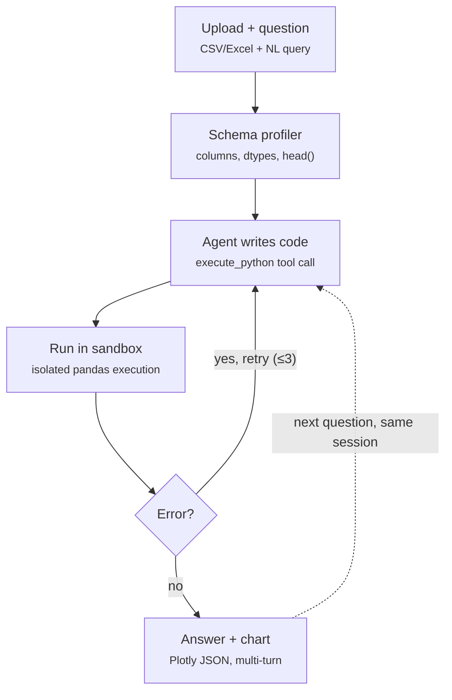

# Data Analysis Agent — "Chat With Your Spreadsheet"
### Tier 2 · Intermediate — Full Workflow & Implementation Plan

**Client problem:** Messy CSV/Excel exports, no analyst to dig into them.
**Core idea:** Upload a file → ask questions in natural language → an agent writes and runs pandas code in a sandbox, self-corrects on error, and returns an answer plus a chart.

---

## 1. Architecture — Complete Workflow

### 1.1 Workflow diagram


*(If your markdown viewer doesn't render Mermaid — e.g. a plain text editor — paste the block above into [mermaid.live](https://mermaid.live) or view it on GitHub.)*

### 1.2 Step-by-step: what actually happens on each turn

1. **Upload (once per session).** User uploads a CSV/Excel file. `main.py:/upload` parses it with pandas, `SchemaProfiler` builds a profile (columns, dtypes, null %, sample rows, numeric stats), and `SessionManager.create()` stores `{df, profile, history}` under a new `session_id`. The frontend gets back a preview table so the user can confirm the file was read correctly before asking anything.

2. **Question (every turn).** User types a natural-language question. The frontend sends `{session_id, question}` to `/query`.

3. **Schema injection.** The backend loads the session's dataframe and profile, and formats `SchemaProfiler.to_prompt_string()` into the agent's system prompt — this is what lets the agent reference real column names instead of guessing.

4. **Agent writes code.** `create_agent` (LangChain) reasons over the question + schema + prior chat history, then calls the `execute_python` tool with a code string. It's told to assign a scalar/table to `result` and, if a chart is warranted, a Plotly figure to `fig`.

5. **Sandboxed execution.** `SandboxExecutor.run()` receives the code, statically rejects dangerous imports (`os`, `subprocess`, `socket`, etc.), then executes it in an isolated subprocess (or Docker container) with CPU/memory/wall-clock limits and the dataframe pre-loaded — no filesystem or network access. It returns `{success, result_repr, figure_json, error}`.

6. **Decision — error?**
   - **Yes →** `self_correct.py` appends the traceback and the failed code back into the message history via `RETRY_PROMPT`, and loops back to step 4. This repeats up to `max_retries` (default 3). Each retry, the agent sees exactly what broke and fixes its own code — this is the "self-correcting" part of the loop.
   - **No →** proceed to step 7.

7. **Answer + chart.** The agent's final natural-language answer, plus the `figure_json` (if a chart was produced) and the `code_run` (for transparency), are returned to the frontend. `SessionManager.append_turn()` saves both the question and answer into the session's history.

8. **Multi-turn continuation.** Because `history` persists in the session, the next question ("now break that down by region") re-enters at step 3 with the full prior conversation available — the agent doesn't need the file re-uploaded or re-explained.

9. **Exhausted retries (edge case).** If all `max_retries` attempts fail, the loop exits with a plain-language explanation of the last error instead of looping forever or throwing a raw traceback at the user.

### 1.3 Key design decisions
- **Stateful session** — the dataframe(s) and chat history persist per session so follow-up questions ("now filter to 2023") work without re-uploading.
- **Sandboxed execution** — the agent never gets real filesystem/network access; code runs in a locked-down subprocess (or Docker container for stronger isolation).
- **Bounded self-correction** — max 3 retries, each retry appends the traceback to the agent's context so it can fix its own code.
- **Structured output** — the tool returns `{stdout, result_repr, figure_json, error}` so the frontend always knows what to render.

---

## 2. Project File Tree

```
data-analysis-agent/
├── backend/
│   ├── main.py
│   ├── config.py
│   ├── requirements.txt
│   ├── agent/
│   │   ├── __init__.py
│   │   ├── agent_builder.py
│   │   ├── prompts.py
│   │   ├── tools.py
│   │   └── self_correct.py
│   ├── sandbox/
│   │   ├── __init__.py
│   │   ├── executor.py
│   │   └── docker/
│   │       └── Dockerfile.sandbox
│   ├── profiler/
│   │   └── schema_profiler.py
│   ├── session/
│   │   └── session_manager.py
│   ├── models/
│   │   └── schemas.py
│   └── tests/
│       ├── test_executor.py
│       ├── test_profiler.py
│       └── test_agent_loop.py
├── frontend/
│   ├── streamlit_app.py
│   └── components/
│       └── chart_renderer.py
├── docker-compose.yml
├── .env.example
└── README.md
```

---

## 3. Backend Files — Detailed Implementation

### 3.1 `backend/config.py`
**Purpose:** Central settings via `pydantic-settings`, loaded from `.env`.

```python
from pydantic_settings import BaseSettings

class Settings(BaseSettings):
    anthropic_api_key: str
    model_name: str = "claude-sonnet-4-6"
    max_retries: int = 3
    sandbox_timeout_seconds: int = 15
    max_upload_mb: int = 25
    session_ttl_minutes: int = 60
    use_docker_sandbox: bool = False  # False = subprocess sandbox, True = Docker

    class Config:
        env_file = ".env"

settings = Settings()
```

### 3.2 `backend/models/schemas.py`
**Purpose:** Pydantic request/response contracts for the API and for the tool's structured return value.

```python
from pydantic import BaseModel
from typing import Optional, Any

class UploadResponse(BaseModel):
    session_id: str
    columns: list[str]
    dtypes: dict[str, str]
    n_rows: int
    preview: list[dict]

class QueryRequest(BaseModel):
    session_id: str
    question: str

class ExecResult(BaseModel):
    success: bool
    stdout: str = ""
    result_repr: Optional[str] = None
    figure_json: Optional[str] = None   # Plotly fig.to_json()
    error: Optional[str] = None
    code_run: str

class QueryResponse(BaseModel):
    answer: str
    figure_json: Optional[str] = None
    code_run: Optional[str] = None
    attempts: int
```

### 3.3 `backend/profiler/schema_profiler.py`
**Purpose:** Turn a raw upload into a compact "data card" the LLM can reason over — column names, dtypes, null %, sample rows, and light stats. This is what gets injected into the system prompt so the agent doesn't hallucinate column names.

Inner logic:
1. Load file with `pandas.read_csv` / `read_excel` (sniff delimiter, handle multiple sheets by prompting user to pick one if >1 sheet).
2. Coerce obviously-numeric object columns (e.g. `"1,200"` strings) — flag but don't silently mutate.
3. Build profile dict:
   - `columns`, `dtypes`
   - `n_rows`, `n_cols`
   - `null_pct` per column
   - `head(5)` as records
   - for numeric cols: min/max/mean; for categorical: top 5 value counts
4. Serialize into a compact markdown table string (`to_prompt_string()`) — this is what's injected into the agent's system prompt, not the whole dataframe.

```python
import pandas as pd

class SchemaProfiler:
    def __init__(self, df: pd.DataFrame):
        self.df = df

    def profile(self) -> dict:
        prof = {
            "columns": list(self.df.columns),
            "dtypes": {c: str(t) for c, t in self.df.dtypes.items()},
            "n_rows": len(self.df),
            "null_pct": (self.df.isna().mean() * 100).round(1).to_dict(),
            "head": self.df.head(5).to_dict(orient="records"),
        }
        for c in self.df.select_dtypes("number").columns:
            prof.setdefault("numeric_stats", {})[c] = {
                "min": float(self.df[c].min()),
                "max": float(self.df[c].max()),
                "mean": round(float(self.df[c].mean()), 3),
            }
        return prof

    def to_prompt_string(self) -> str:
        p = self.profile()
        lines = [f"Rows: {p['n_rows']}", "Columns:"]
        for c in p["columns"]:
            lines.append(f"- {c} ({p['dtypes'][c]}, {p['null_pct'][c]}% null)")
        lines.append(f"Sample rows: {p['head']}")
        return "\n".join(lines)
```

### 3.4 `backend/session/session_manager.py`
**Purpose:** In-memory (or Redis-backed for multi-worker deploys) store keyed by `session_id`, holding the dataframe, chat history, and profile — so multi-turn works and files aren't re-parsed each turn.

```python
import uuid, time
from threading import Lock

class SessionManager:
    def __init__(self, ttl_minutes: int = 60):
        self._store: dict[str, dict] = {}
        self._lock = Lock()
        self.ttl = ttl_minutes * 60

    def create(self, df, profile) -> str:
        sid = str(uuid.uuid4())
        with self._lock:
            self._store[sid] = {
                "df": df, "profile": profile,
                "history": [], "created": time.time(),
            }
        return sid

    def get(self, sid: str) -> dict:
        self._evict_expired()
        if sid not in self._store:
            raise KeyError("Session not found or expired")
        return self._store[sid]

    def append_turn(self, sid: str, role: str, content: str):
        self._store[sid]["history"].append({"role": role, "content": content})

    def _evict_expired(self):
        now = time.time()
        with self._lock:
            for sid in [s for s, v in self._store.items() if now - v["created"] > self.ttl]:
                del self._store[sid]

session_manager = SessionManager()
```
Production note: swap the dict for Redis (`df` pickled or stored as parquet on disk with a path reference) once you run more than one backend worker.

### 3.5 `backend/sandbox/executor.py`
**Purpose:** The actual sandboxed `execute_python` runtime. This is the security-critical file. Two implementations, gated by `settings.use_docker_sandbox`.

**Subprocess sandbox (default, fast, good for a demo/POC):**
- Spawns a fresh Python subprocess per call with `resource` limits (CPU time, memory via `RLIMIT_AS`), no network (drop via `unshare -n` on Linux or a restricted env), and a hard wall-clock `timeout`.
- Injects only `pandas as pd`, `numpy as np`, `plotly.express as px`, `plotly.graph_objects as go`, and the dataframe `df` into the subprocess's globals — no `os`, `sys`, `subprocess`, `open` builtins (stripped via `builtins` allowlist).
- Captures stdout, the repr of the last expression, and — if the code creates a Plotly figure named `fig` — serializes it to JSON.

```python
import subprocess, sys, json, tempfile, textwrap, resource, os

BLOCKED_IMPORTS = {"os", "sys", "subprocess", "shutil", "socket", "requests", "urllib"}

class SandboxExecutor:
    def __init__(self, timeout_s: int = 15):
        self.timeout_s = timeout_s

    def _static_check(self, code: str):
        for bad in BLOCKED_IMPORTS:
            if f"import {bad}" in code or f"from {bad}" in code:
                raise ValueError(f"Use of module '{bad}' is not permitted in the sandbox.")

    def run(self, code: str, df_pickle_path: str) -> dict:
        self._static_check(code)
        runner = textwrap.dedent(f"""
            import resource, pickle, json, sys
            resource.setrlimit(resource.RLIMIT_AS, (512 * 1024 * 1024, 512 * 1024 * 1024))
            resource.setrlimit(resource.RLIMIT_CPU, ({self.timeout_s}, {self.timeout_s}))
            import pandas as pd, numpy as np
            import plotly.express as px, plotly.graph_objects as go
            df = pickle.load(open({df_pickle_path!r}, "rb"))
            fig = None
            ns = {{"pd": pd, "np": np, "px": px, "go": go, "df": df}}
            try:
                exec(compile({code!r}, "<agent_code>", "exec"), ns)
                out = {{
                    "success": True,
                    "result_repr": repr(ns.get("result", "")),
                    "figure_json": ns["fig"].to_json() if ns.get("fig") is not None else None,
                }}
            except Exception as e:
                out = {{"success": False, "error": f"{{type(e).__name__}}: {{e}}"}}
            print(json.dumps(out))
        """)
        proc = subprocess.run(
            [sys.executable, "-I", "-c", runner],   # -I: isolated mode, ignores env/user site-packages
            capture_output=True, text=True, timeout=self.timeout_s + 2,
        )
        try:
            return json.loads(proc.stdout.strip().splitlines()[-1])
        except Exception:
            return {"success": False, "error": proc.stderr or "Sandbox produced no output."}
```

**Docker sandbox (`use_docker_sandbox=True`, recommended for anything internet-facing):**
- Same code contract, but each call runs `docker run --rm --network=none --memory=512m --cpus=1 --read-only -v /tmp/session:/data:ro sandbox-image python /data/run.py`.
- `sandbox/docker/Dockerfile.sandbox` builds a minimal image with pinned `pandas`, `numpy`, `plotly` — nothing else — so even a jailbroken script has no useful tools available.

### 3.6 `backend/sandbox/docker/Dockerfile.sandbox`
```dockerfile
FROM python:3.11-slim
RUN pip install --no-cache-dir pandas==2.2.2 numpy==1.26.4 plotly==5.22.0
RUN useradd -m sandboxuser
USER sandboxuser
WORKDIR /data
ENTRYPOINT ["python", "run.py"]
```

### 3.7 `backend/agent/prompts.py`
**Purpose:** System prompt templates — one for initial code generation, one for the self-correction retry turn.

```python
SYSTEM_PROMPT = """You are a data analysis agent. You have a pandas DataFrame called `df` already loaded.
Schema:
{schema}

Rules:
- Write ONLY pandas/numpy/plotly code inside the execute_python tool call.
- Never read files or use the network; `df` is already loaded.
- If the user asks for a chart, build it with plotly and assign it to a variable named `fig`.
- Assign your final scalar/table answer to a variable named `result`.
- Keep code short and correct. Do not print secrets or attempt file/network access.
"""

RETRY_PROMPT = """Your last code failed with this error:
{error}

Code that failed:
{code}

Fix the code and call execute_python again. This is attempt {attempt} of {max_retries}."""
```

### 3.8 `backend/agent/tools.py`
**Purpose:** LangChain tool wrapper exposing `execute_python` to the agent, bridging to `SandboxExecutor`.

```python
from langchain_core.tools import tool
from backend.sandbox.executor import SandboxExecutor
import pickle, tempfile

executor = SandboxExecutor()

def make_execute_python_tool(df, sandbox_timeout: int):
    tmp = tempfile.NamedTemporaryFile(suffix=".pkl", delete=False)
    pickle.dump(df, open(tmp.name, "wb"))

    @tool
    def execute_python(code: str) -> dict:
        """Execute pandas/plotly code against the loaded DataFrame `df`.
        Assign a scalar/table to `result` and, optionally, a Plotly figure to `fig`."""
        return executor.run(code, tmp.name)

    return execute_python
```

### 3.9 `backend/agent/agent_builder.py`
**Purpose:** Wires everything with LangChain's `create_agent` (tool-calling agent), binds the per-session `execute_python` tool, and returns a runnable.

```python
from langchain.agents import create_agent
from langchain_anthropic import ChatAnthropic
from backend.agent.prompts import SYSTEM_PROMPT
from backend.agent.tools import make_execute_python_tool
from backend.config import settings

def build_agent(df, profile_str: str):
    llm = ChatAnthropic(model=settings.model_name, temperature=0)
    exec_tool = make_execute_python_tool(df, settings.sandbox_timeout_seconds)
    agent = create_agent(
        model=llm,
        tools=[exec_tool],
        system_prompt=SYSTEM_PROMPT.format(schema=profile_str),
    )
    return agent
```

### 3.10 `backend/agent/self_correct.py`
**Purpose:** The retry loop that turns "❌ Error → retry ≤3" from the diagram into code. Wraps the agent invocation, inspects the tool result, and re-prompts on failure.

```python
from backend.agent.prompts import RETRY_PROMPT
from backend.config import settings

def run_with_self_correction(agent, question: str, history: list) -> dict:
    messages = history + [{"role": "user", "content": question}]
    last_error, last_code, attempts = None, None, 0

    for attempt in range(1, settings.max_retries + 1):
        attempts = attempt
        result = agent.invoke({"messages": messages})
        tool_calls = [m for m in result["messages"] if getattr(m, "tool_calls", None)]
        exec_results = [m for m in result["messages"] if getattr(m, "name", "") == "execute_python"]

        if not exec_results:
            # Agent answered without needing code (e.g. clarifying question)
            return {"answer": result["messages"][-1].content, "figure_json": None,
                    "code_run": None, "attempts": attempt}

        last = exec_results[-1].content  # dict from SandboxExecutor
        last_code = tool_calls[-1].tool_calls[-1]["args"].get("code")

        if last.get("success"):
            final_text = result["messages"][-1].content
            return {"answer": final_text, "figure_json": last.get("figure_json"),
                    "code_run": last_code, "attempts": attempt}

        last_error = last.get("error")
        messages.append({
            "role": "user",
            "content": RETRY_PROMPT.format(error=last_error, code=last_code,
                                            attempt=attempt + 1, max_retries=settings.max_retries),
        })

    return {"answer": f"I couldn't complete this after {settings.max_retries} attempts. "
                       f"Last error: {last_error}",
            "figure_json": None, "code_run": last_code, "attempts": attempts}
```

### 3.11 `backend/main.py`
**Purpose:** FastAPI app — three endpoints matching the diagram's three input/output edges: upload, query, and (optionally) reset.

```python
from fastapi import FastAPI, UploadFile, HTTPException
import pandas as pd, io
from backend.models.schemas import UploadResponse, QueryRequest, QueryResponse
from backend.profiler.schema_profiler import SchemaProfiler
from backend.session.session_manager import session_manager
from backend.agent.agent_builder import build_agent
from backend.agent.self_correct import run_with_self_correction

app = FastAPI(title="Data Analysis Agent")

@app.post("/upload", response_model=UploadResponse)
async def upload(file: UploadFile):
    raw = await file.read()
    if file.filename.endswith(".csv"):
        df = pd.read_csv(io.BytesIO(raw))
    elif file.filename.endswith((".xlsx", ".xls")):
        df = pd.read_excel(io.BytesIO(raw))
    else:
        raise HTTPException(400, "Only .csv, .xlsx, .xls supported")

    profile = SchemaProfiler(df).profile()
    sid = session_manager.create(df, profile)
    return UploadResponse(session_id=sid, columns=profile["columns"],
                           dtypes=profile["dtypes"], n_rows=profile["n_rows"],
                           preview=profile["head"])

@app.post("/query", response_model=QueryResponse)
async def query(req: QueryRequest):
    try:
        sess = session_manager.get(req.session_id)
    except KeyError:
        raise HTTPException(404, "Session expired, please re-upload.")

    profile_str = SchemaProfiler(sess["df"]).to_prompt_string()
    agent = build_agent(sess["df"], profile_str)
    result = run_with_self_correction(agent, req.question, sess["history"])

    session_manager.append_turn(req.session_id, "user", req.question)
    session_manager.append_turn(req.session_id, "assistant", result["answer"])
    return QueryResponse(**result)
```

### 3.12 `backend/requirements.txt`
```
fastapi
uvicorn[standard]
pandas
numpy
openpyxl
plotly
langchain
langchain-anthropic
pydantic-settings
python-multipart
```

---

## 4. Frontend

### 4.1 `frontend/streamlit_app.py`
**Purpose:** Minimal chat UI — file uploader, chat input, renders text answer + Plotly chart inline. (Swap for a React/Next.js chat widget later; contract stays the same since it just calls `/upload` and `/query`.)

Inner logic:
1. `st.file_uploader` → POST to `/upload`, store `session_id` in `st.session_state`.
2. Show a preview table (`profile.preview`) and dtypes so the user trusts the schema was read correctly.
3. `st.chat_input` → POST to `/query`, append user + assistant turns to `st.session_state.messages`.
4. If `figure_json` present, `st.plotly_chart(pio.from_json(figure_json))`; else just render `answer` text.
5. Sidebar shows `code_run` in an expandable code block for transparency/debuggability.

```python
import streamlit as st, requests, plotly.io as pio

API = "http://localhost:8000"
st.title("📊 Chat with your Spreadsheet")

if "session_id" not in st.session_state:
    st.session_state.session_id = None
    st.session_state.messages = []

file = st.file_uploader("Upload CSV or Excel", type=["csv", "xlsx", "xls"])
if file and st.session_state.session_id is None:
    resp = requests.post(f"{API}/upload", files={"file": file}).json()
    st.session_state.session_id = resp["session_id"]
    st.dataframe(resp["preview"])
    st.caption(f"{resp['n_rows']} rows · {len(resp['columns'])} columns")

for m in st.session_state.messages:
    with st.chat_message(m["role"]):
        st.write(m["content"])
        if m.get("figure_json"):
            st.plotly_chart(pio.from_json(m["figure_json"]))

if q := st.chat_input("Ask a question about your data..."):
    st.session_state.messages.append({"role": "user", "content": q})
    with st.chat_message("user"):
        st.write(q)
    resp = requests.post(f"{API}/query", json={
        "session_id": st.session_state.session_id, "question": q
    }).json()
    with st.chat_message("assistant"):
        st.write(resp["answer"])
        if resp.get("figure_json"):
            st.plotly_chart(pio.from_json(resp["figure_json"]))
        with st.expander(f"Code run ({resp['attempts']} attempt(s))"):
            st.code(resp.get("code_run") or "", language="python")
    st.session_state.messages.append({
        "role": "assistant", "content": resp["answer"], "figure_json": resp.get("figure_json")
    })
```

---

## 5. Tests

### 5.1 `backend/tests/test_executor.py`
- Happy path: `result = df['col'].mean()` returns correct `result_repr`.
- Blocked import: `import os` → `success=False`, clear error.
- Chart path: code producing `fig = px.bar(...)` returns non-null `figure_json`.
- Timeout: infinite loop is killed within `sandbox_timeout_seconds + 2`.

### 5.2 `backend/tests/test_profiler.py`
- Null-percentage math correct on a fixture DataFrame with known NaNs.
- `to_prompt_string()` never dumps the full dataframe (length-bounded).

### 5.3 `backend/tests/test_agent_loop.py`
- Mock the LLM to return broken code once, then fixed code → assert `attempts == 2` and final `success`.
- Mock 3 consecutive failures → assert graceful "couldn't complete" message, no exception raised.

---

## 6. Deployment

### 6.1 `docker-compose.yml`
```yaml
services:
  backend:
    build: ./backend
    ports: ["8000:8000"]
    env_file: .env
    environment:
      - USE_DOCKER_SANDBOX=true
    volumes:
      - /var/run/docker.sock:/var/run/docker.sock   # only if backend spawns sandbox containers
  frontend:
    build: ./frontend
    ports: ["8501:8501"]
    depends_on: [backend]
```

### 6.2 `.env.example`
```
ANTHROPIC_API_KEY=sk-ant-...
MODEL_NAME=claude-sonnet-4-6
MAX_RETRIES=3
SANDBOX_TIMEOUT_SECONDS=15
MAX_UPLOAD_MB=25
SESSION_TTL_MINUTES=60
USE_DOCKER_SANDBOX=false
```

### 6.3 `README.md` — should cover
- Quickstart (`docker compose up`, then open `localhost:8501`)
- How the sandbox isolation works and its limits (subprocess vs Docker trade-off)
- How to swap `SessionManager` for Redis in a multi-worker deploy
- How to point at a different LLM provider by swapping `ChatAnthropic` in `agent_builder.py`

---

## 7. Build Order (recommended sequence)

1. `config.py`, `models/schemas.py` — get contracts nailed down first.
2. `profiler/schema_profiler.py` + its test — this has no LLM dependency, fastest to verify.
3. `sandbox/executor.py` (subprocess version) + its test — security-critical, test in isolation before wiring to the agent.
4. `agent/prompts.py`, `agent/tools.py`, `agent/agent_builder.py` — wire the LLM to the sandbox.
5. `agent/self_correct.py` + its test with a mocked LLM — verify the retry loop logic without burning API calls.
6. `session/session_manager.py`, `main.py` — expose it all over HTTP.
7. `frontend/streamlit_app.py` — thin client against the now-working API.
8. Swap in the Docker sandbox (`use_docker_sandbox=True`) once the subprocess path is proven, before any public deployment.
9. `docker-compose.yml` + README for handoff.

---

## 8. Guardrails Checklist Before Shipping

- [ ] Sandbox has no network access and no filesystem access outside its temp/read-only mount.
- [ ] Static check blocks dangerous imports even before execution attempts.
- [ ] CPU/memory/wall-clock limits enforced on every run, not just the "happy path."
- [ ] Retry loop is hard-capped (no infinite agent loops burning API spend).
- [ ] Uploaded file size capped (`max_upload_mb`) and only `.csv`/`.xlsx`/`.xls` accepted.
- [ ] Sessions expire (`session_ttl_minutes`) so uploaded data isn't retained indefinitely in memory.
- [ ] `code_run` is surfaced to the user in the UI — never execute or show hidden code silently.
