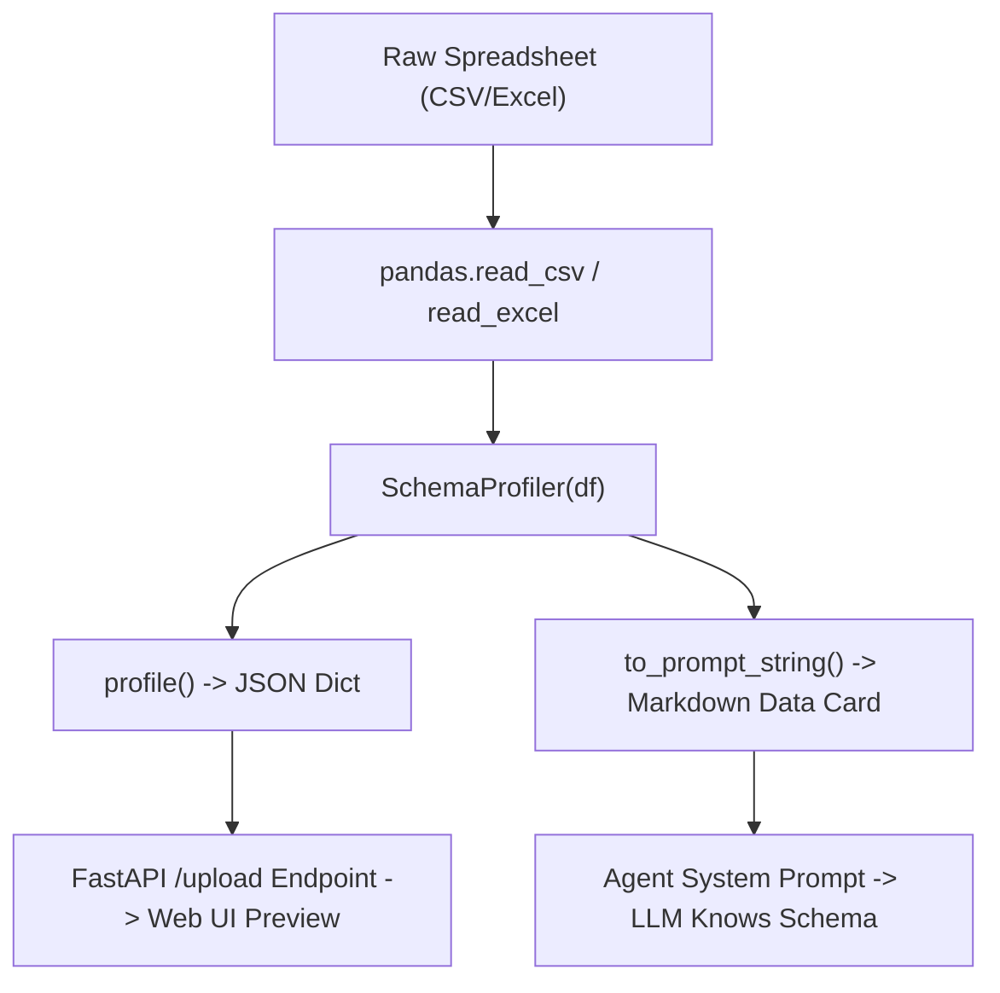

# 📖 Comprehensive Deep Dive: `backend/profiler/schema_profiler.py`

This document provides a line-by-line, step-by-step explanation of [`SchemaProfiler`](file:///d:/Projects/Data%20Analysis%20Agent/backend/profiler/schema_profiler.py), detailing its architecture, algorithmic steps, edge-case protections, and integration with the AI agent.

---

## 1. High-Level Architecture & Purpose

### The Problem
When users upload spreadsheets with thousands or millions of rows:
1. **Context Window Limits**: You cannot pass entire CSV/Excel files into LLM prompts without exceeding token limits or incurring massive costs.
2. **Hallucination Risk**: If the model is not given exact column names, data types, and formatting quirks, it guesses column names (e.g., guessing `revenue` when the column is actually named `Total_Sales_USD`).
3. **Type Confusion**: The model needs to know whether columns are numeric, categorical, dates, or strings to generate valid pandas operations.

### The Solution
`SchemaProfiler` acts as a **Metadata Extraction & Distillation Engine**. It takes a raw `pandas.DataFrame` and produces:
- A structured Python dictionary for the frontend (`profile()`).
- A compact, token-efficient Markdown "Data Card" for the LLM system prompt (`to_prompt_string()`).



---

## 2. Complete Annotated Source Code

```python
import math
from typing import Any
import pandas as pd


class SchemaProfiler:
    """
    Profiles a pandas DataFrame to extract schema information,
    summary statistics, null percentages, and formatted prompt strings
    for LLM reasoning.
    """

    def __init__(self, df: pd.DataFrame):
        self.df = df

    def profile(self) -> dict[str, Any]:
        """
        Extracts structured metadata from the DataFrame.
        Returns a dictionary containing:
          - columns: list of column names
          - dtypes: column name to string dtype mapping
          - n_rows: total row count
          - n_cols: total column count
          - null_pct: percentage of missing values per column
          - head: first 5 records with NaN replaced by None
          - numeric_stats: min, max, mean for numeric columns
          - categorical_stats: top 5 frequent values for text columns
        """
        # Step 1: Dataset dimensions
        n_rows = len(self.df)
        n_cols = len(self.df.columns)

        # Step 2: Clean 5-row preview for JSON serialization
        preview_df = self.df.head(5).copy()
        preview_records = preview_df.where(pd.notnull(preview_df), None).to_dict(orient="records")

        # Step 3: Compute null percentage per column
        null_pct = {}
        for c in self.df.columns:
            pct = (self.df[c].isna().mean() * 100) if n_rows > 0 else 0.0
            null_pct[c] = round(float(pct), 1)

        # Step 4: Construct core dictionary
        prof: dict[str, Any] = {
            "columns": [str(c) for c in self.df.columns],
            "dtypes": {str(c): str(t) for c, t in self.df.dtypes.items()},
            "n_rows": n_rows,
            "n_cols": n_cols,
            "null_pct": null_pct,
            "head": preview_records,
            "numeric_stats": {},
            "categorical_stats": {},
        }

        # Step 5: Extract statistics for numeric columns
        numeric_cols = self.df.select_dtypes(include="number").columns
        for c in numeric_cols:
            series = self.df[c].dropna()
            if not series.empty:
                min_val = float(series.min())
                max_val = float(series.max())
                mean_val = float(series.mean())
                prof["numeric_stats"][str(c)] = {
                    "min": None if math.isnan(min_val) else round(min_val, 3),
                    "max": None if math.isnan(max_val) else round(max_val, 3),
                    "mean": None if math.isnan(mean_val) else round(mean_val, 3),
                }

        # Step 6: Extract top frequencies for categorical & string columns
        cat_cols = self.df.select_dtypes(include=["object", "category", "string"]).columns
        for c in cat_cols:
            series = self.df[c].dropna()
            if not series.empty:
                top_counts = series.value_counts().head(5).to_dict()
                prof["categorical_stats"][str(c)] = {str(k): int(v) for k, v in top_counts.items()}

        return prof

    def to_prompt_string(self) -> str:
        """
        Formats the profile dictionary into a compact Markdown string
        injected into the AI agent's system prompt.
        """
        p = self.profile()
        lines = [f"Dataset Shape: {p['n_rows']} rows x {p['n_cols']} columns", "Columns:"]
        for c in p["columns"]:
            dtype = p["dtypes"].get(c, "unknown")
            nulls = p["null_pct"].get(c, 0.0)
            col_info = f"- `{c}` ({dtype}, {nulls}% null)"

            if c in p.get("numeric_stats", {}):
                stats = p["numeric_stats"][c]
                col_info += f" | min={stats['min']}, max={stats['max']}, mean={stats['mean']}"
            elif c in p.get("categorical_stats", {}):
                cats = p["categorical_stats"][c]
                top_items = [f"{k}: {v}" for k, v in list(cats.items())[:3]]
                if top_items:
                    col_info += f" | top values: [{', '.join(top_items)}]"

            lines.append(col_info)

        lines.append("\nSample rows (first 5):")
        for i, row in enumerate(p["head"], 1):
            lines.append(f"{i}. {row}")

        return "\n".join(lines)
```

---

## 3. Step-by-Step, Line-by-Line Breakdown

### Section 1: Module Imports (Lines 1–3)

```python
import math
from typing import Any
import pandas as pd
```
- **`import math`**: Provides `math.isnan()` to check whether floating-point calculations produce `NaN` (Not a Number), preventing invalid JSON serialization.
- **`from typing import Any`**: Type annotation used to denote flexible dictionary values in `dict[str, Any]`.
- **`import pandas as pd`**: Core data analysis library used for DataFrame inspection, series slicing, and statistical aggregations.

---

### Section 2: Constructor `__init__` (Lines 6–8)

```python
class SchemaProfiler:
    def __init__(self, df: pd.DataFrame):
        self.df = df
```
- **`class SchemaProfiler`**: Encapsulates all profiling logic for a single DataFrame instance.
- **`def __init__(self, df: pd.DataFrame)`**: Receives the user's parsed pandas DataFrame and retains a reference in `self.df`.

---

### Section 3: `profile()` Method (Lines 10–57)

```python
    def profile(self) -> dict[str, Any]:
```
Returns a structured dictionary matching the [`UploadResponse`](file:///d:/Projects/Data%20Analysis%20Agent/backend/models/schemas.py#L6-L11) Pydantic model and internal session storage.

#### Step 1: Shape Calculation (Lines 11–13)
```python
        n_rows = len(self.df)
        n_cols = len(self.df.columns)
```
- `len(self.df)` gives the total number of rows.
- `len(self.df.columns)` gives the total number of columns.
- **Edge Case Protection**: Works accurately even if the DataFrame is empty (`n_rows = 0`).

#### Step 2: JSON-Safe Sample Extraction (Lines 15–17)
```python
        preview_df = self.df.head(5).copy()
        preview_records = preview_df.where(pd.notnull(preview_df), None).to_dict(orient="records")
```
- `.head(5).copy()`: Extracts the first 5 rows in an isolated memory buffer.
- `preview_df.where(pd.notnull(preview_df), None)`: Standard JSON format cannot parse `NaN` or `NaT` (Not a Time). This replaces missing values with Python `None`, which safely converts to `null` in JSON.
- `.to_dict(orient="records")`: Transforms the preview into a list of row dictionaries:
  ```python
  [
      {"id": 1, "product": "Laptop", "price": 1200.0},
      {"id": 2, "product": "Mouse", "price": 25.0}
  ]
  ```

#### Step 3: Missing Value Percentages (Lines 19–22)
```python
        null_pct = {}
        for c in self.df.columns:
            pct = (self.df[c].isna().mean() * 100) if n_rows > 0 else 0.0
            null_pct[c] = round(float(pct), 1)
```
- `self.df[c].isna().mean()`: Computes the proportion of null cells (e.g. 5 nulls out of 100 rows = `0.05`).
- `* 100`: Converts to percentage (`5.0%`).
- `if n_rows > 0 else 0.0`: Prevents division-by-zero errors on empty datasets.
- `round(..., 1)`: Rounds to one decimal place for readability.

#### Step 4: Building the Profile Structure (Lines 24–33)
```python
        prof: dict[str, Any] = {
            "columns": [str(c) for c in self.df.columns],
            "dtypes": {str(c): str(t) for c, t in self.df.dtypes.items()},
            "n_rows": n_rows,
            "n_cols": n_cols,
            "null_pct": null_pct,
            "head": preview_records,
            "numeric_stats": {},
            "categorical_stats": {},
        }
```
- Forces all column names and dtypes to strings (`str(c)` and `str(t)`) to avoid serialization errors if columns were loaded as integers or tuples.

#### Step 5: Numeric Summaries (Lines 35–47)
```python
        numeric_cols = self.df.select_dtypes(include="number").columns
        for c in numeric_cols:
            series = self.df[c].dropna()
            if not series.empty:
                min_val = float(series.min())
                max_val = float(series.max())
                mean_val = float(series.mean())
                prof["numeric_stats"][str(c)] = {
                    "min": None if math.isnan(min_val) else round(min_val, 3),
                    "max": None if math.isnan(max_val) else round(max_val, 3),
                    "mean": None if math.isnan(mean_val) else round(mean_val, 3),
                }
```
- `select_dtypes(include="number")`: Filters for `int64`, `float64`, `int32`, `float32`, `uint8`, etc.
- `.dropna()`: Strips `NaN` values before computing min, max, and mean.
- `float(series.min())`: Casts numpy scalar types (like `np.int64` / `np.float64`) to native Python `float`.
- `math.isnan()` guard: Ensures that if an all-NaN column exists, it yields `None` rather than invalid JSON `NaN`.

#### Step 6: Categorical & String Summaries (Lines 49–56)
```python
        cat_cols = self.df.select_dtypes(include=["object", "category", "string"]).columns
        for c in cat_cols:
            series = self.df[c].dropna()
            if not series.empty:
                top_counts = series.value_counts().head(5).to_dict()
                prof["categorical_stats"][str(c)] = {str(k): int(v) for k, v in top_counts.items()}
        return prof
```
- `select_dtypes(include=["object", "category", "string"])`: Filters for text and discrete categorical variables.
- `series.value_counts().head(5)`: Identifies the top 5 most common categories and their frequencies.
- Converted to a clean `{ "CategoryName": count }` dictionary.

---

### Section 4: `to_prompt_string()` Method (Lines 59–82)

```python
    def to_prompt_string(self) -> str:
        p = self.profile()
        lines = [f"Dataset Shape: {p['n_rows']} rows x {p['n_cols']} columns", "Columns:"]
```
- Takes the profile dictionary and compiles it into a markdown document for the LLM system prompt.

```python
        for c in p["columns"]:
            dtype = p["dtypes"].get(c, "unknown")
            nulls = p["null_pct"].get(c, 0.0)
            col_info = f"- `{c}` ({dtype}, {nulls}% null)"

            if c in p.get("numeric_stats", {}):
                stats = p["numeric_stats"][c]
                col_info += f" | min={stats['min']}, max={stats['max']}, mean={stats['mean']}"
            elif c in p.get("categorical_stats", {}):
                cats = p["categorical_stats"][c]
                top_items = [f"{k}: {v}" for k, v in list(cats.items())[:3]]
                if top_items:
                    col_info += f" | top values: [{', '.join(top_items)}]"

            lines.append(col_info)
```
- Constructs compact bullet points.
- If numeric: adds `| min=..., max=..., mean=...`.
- If categorical: adds top 3 frequent values `| top values: [Item1: count1, Item2: count2]`.

```python
        lines.append("\nSample rows (first 5):")
        for i, row in enumerate(p["head"], 1):
            lines.append(f"{i}. {row}")

        return "\n".join(lines)
```
- Adds the 5 preview rows.
- Returns the full string.

---

## 4. Practical Example: Input vs. Output

### Input DataFrame
| employee_id | department | salary | performance_score |
|---|---|---|---|
| 101 | Engineering | 95000.0 | 4.8 |
| 102 | Marketing | 68000.0 | 4.2 |
| 103 | Engineering | 105000.0 | 4.9 |
| 104 | Sales | 72000.0 | 3.9 |
| 105 | Engineering | 88000.0 | 4.5 |

---

### Output of `profile()` (JSON Structure)
```json
{
  "columns": ["employee_id", "department", "salary", "performance_score"],
  "dtypes": {
    "employee_id": "int64",
    "department": "object",
    "salary": "float64",
    "performance_score": "float64"
  },
  "n_rows": 5,
  "n_cols": 4,
  "null_pct": {
    "employee_id": 0.0,
    "department": 0.0,
    "salary": 0.0,
    "performance_score": 0.0
  },
  "head": [
    {"employee_id": 101, "department": "Engineering", "salary": 95000.0, "performance_score": 4.8},
    {"employee_id": 102, "department": "Marketing", "salary": 68000.0, "performance_score": 4.2},
    {"employee_id": 103, "department": "Engineering", "salary": 105000.0, "performance_score": 4.9},
    {"employee_id": 104, "department": "Sales", "salary": 72000.0, "performance_score": 3.9},
    {"employee_id": 105, "department": "Engineering", "salary": 88000.0, "performance_score": 4.5}
  ],
  "numeric_stats": {
    "employee_id": {"min": 101.0, "max": 105.0, "mean": 103.0},
    "salary": {"min": 68000.0, "max": 105000.0, "mean": 85600.0},
    "performance_score": {"min": 3.9, "max": 4.9, "mean": 4.46}
  },
  "categorical_stats": {
    "department": {"Engineering": 3, "Marketing": 1, "Sales": 1}
  }
}
```

---

### Output of `to_prompt_string()` (Injected to LLM System Prompt)
```markdown
Dataset Shape: 5 rows x 4 columns
Columns:
- `employee_id` (int64, 0.0% null) | min=101.0, max=105.0, mean=103.0
- `department` (object, 0.0% null) | top values: [Engineering: 3, Marketing: 1, Sales: 1]
- `salary` (float64, 0.0% null) | min=68000.0, max=105000.0, mean=85600.0
- `performance_score` (float64, 0.0% null) | min=3.9, max=4.9, mean=4.46

Sample rows (first 5):
1. {'employee_id': 101, 'department': 'Engineering', 'salary': 95000.0, 'performance_score': 4.8}
2. {'employee_id': 102, 'department': 'Marketing', 'salary': 68000.0, 'performance_score': 4.2}
3. {'employee_id': 103, 'department': 'Engineering', 'salary': 105000.0, 'performance_score': 4.9}
4. {'employee_id': 104, 'department': 'Sales', 'salary': 72000.0, 'performance_score': 3.9}
5. {'employee_id': 105, 'department': 'Engineering', 'salary': 88000.0, 'performance_score': 4.5}
```
